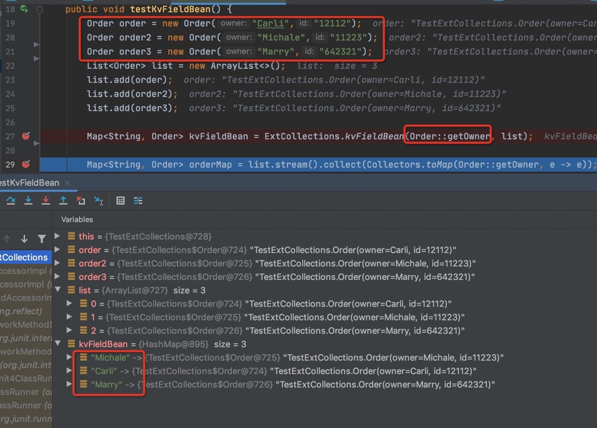
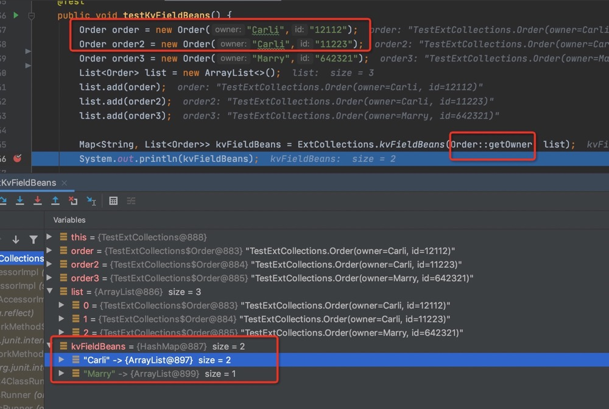
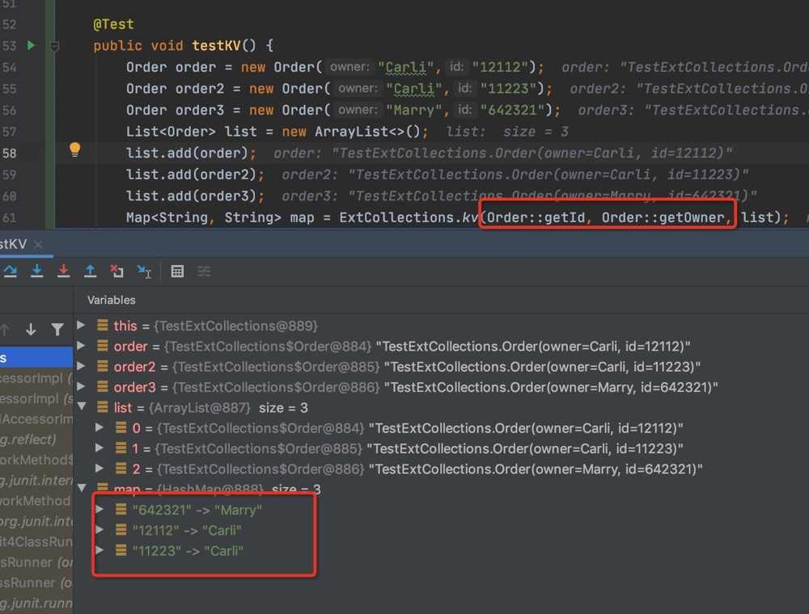

# 常用工具集合 basic-tool
文档地址见：https://aaa-aa.github.io/basic-tools/

- [常用工具集合 basic-tool](#)
  * [超大文本极速读取工具类](#超大文本极速读取工具类)
    + [使用说明](#)
    + [实际效果见博客](#)
  * [校验工具类使用说明](#校验工具类使用说明)
  * [日期工具类使用说明](#日期工具类使用说明)
    + [获取当天零点](#)
    + [将日期类型格式化为字符串](#)
    + [将字符串类型parse为日期类型](#)
    + [对日期时间的各类操作](#)
  * [拓展集合使用说明](#拓展集合使用说明)
    + [list转map](#)
    + [list中key相同合并操作](#)
    + [list中任选k,v字段，重组为map](#)
  * [身份证工具类说明](#身份证工具类说明)
    + [有效身份证号自动生成](#)
    + [年龄提取](#)
    + [出生年月提取](#)
    + [身份证合法性校验](#)
    + [15到18位身份证转换](#)
  * [日志格式化工具说明](#日志格式化工具说明)
    + [敏感或超长字符串截断](#)
    + [敏感信息直接置为******](#)
    + [敏感字段集合直接过滤](#)
  * [随机工具类说明](#随机工具类说明)
    + [指定概率命中](#)
    + [随机生成指定长度数字、字符串或数字字符串混合](#)
    + [生成8-16位含数字、小写和大写字母的随机密码，有校验](#)
  * [字符串工具类说明](#字符串工具类说明)
    + [下划线变驼峰(LineToHump)](#)
    + [驼峰变下划线(HumpToLine)](#)
    + [截取字符串(Cut string)](#)


## 超大文本极速读取工具类

### 使用说明

```java
public static void main(String[] args) {
        AtomicLong counter = new AtomicLong(0);
        String bigFilePath = "/Users/renhongqiang/Downloads/work-doc/2000W/test.csv";
        BigFileReader.Builder builder = new BigFileReader.Builder(bigFilePath, line -> System.out.println(String.format("total record: %s,line is: %s", counter.incrementAndGet(), line)));
        BigFileReader bigFileReader = builder
                .threadPoolSize(100)
                .charset(StandardCharsets.UTF_8)
                .bufferSize(1024 * 1024).build();
        bigFileReader.start();
}
```
### 实际效果见博客

[多线程极速读取超大文件](https://blog.csdn.net/Justnow_/article/details/95505899)


## 校验工具类使用说明

支持集合、字符串、对象判空，注解类判定，以及各类综合操作


## 日期工具类使用说明

### 获取当天零点
```java
Date today = Dates.today();
```
### 将日期类型格式化为字符串
```java
Date date = Dates.addDays(custDate, 32);
String format = Dates.format(date);
```

### 将字符串类型parse为日期类型
```java
Date custDate = Dates.parse("2020-04-23 25", Dates.DATE_FORMAT);
```
### 对日期时间的各类操作
```java
Date date = Dates.addDays(custDate, 32);
Date addM = Dates.addMinutes(date,5);

```

## 拓展集合使用说明

### list转map

```java
Order order = new Order("Carli","12112");
Order order2 = new Order("Michale","11223");
Order order3 = new Order("Marry","642321");
List<Order> list = new ArrayList<>();
list.add(order);
list.add(order2);
list.add(order3);
Map<String, Order> kvFieldBean = ExtCollections.kvFieldBean(Order::getOwner, list);

```


### list中key相同合并操作

```java
Order order = new Order("Carli","12112");
Order order2 = new Order("Carli","11223");
Order order3 = new Order("Marry","642321");
List<Order> list = new ArrayList<>();
list.add(order);
list.add(order2);
list.add(order3);

Map<String, List<Order>> kvFieldBeans = ExtCollections.kvFieldBeans(Order::getOwner, list);
System.out.println(kvFieldBeans);
```

### list中任选k,v字段，重组为map

```java
Order order = new Order("Carli","12112");
Order order2 = new Order("Carli","11223");
Order order3 = new Order("Marry","642321");
List<Order> list = new ArrayList<>();
list.add(order);
list.add(order2);
list.add(order3);
Map<String, String> map = ExtCollections.kv(Order::getId, Order::getOwner, list);
```


## 身份证工具类说明

### 有效身份证号自动生成
```java
@Test
public void testGenerate() {
    System.out.println(IdCards.generate());
    System.out.println(IdCards.generateByAreaName("东城区"));
}
```
### 年龄提取
```java
IdCards.parseAge("420102199401015244")
```
### 出生年月提取
```java
IdCards.parseBirthday("420102199401015244")
```
### 身份证合法性校验
```java
boolean checkCardId = IdCards.checkCardId("420102199401015244");
```

### 15到18位身份证转换

```java
String idCard = IdCards.trans15To18("420102199401015")
```

## 日志格式化工具说明

### 敏感或超长字符串截断
在需要的字段上加 @HideImg
```java
@Test
    public void testHide() {
        Person person = new Person();
        System.out.println(LogFormats.formatLog(person));
    }

    @Data
    public static class Person {

        @HideImg
        private String img = "/9jhfsdhajfksjdfhuhiuwbjbdfoasuhrttttttthhhhhhhhhhhhhhhhhhdfuf";

        @HideAnn
        private String password = "128397287827802hhfashfkjhasfh";

        @HideCollection
        private List<String> cellphones = new ArrayList<>();
    }
```

### 敏感信息直接置为******
直接在字段上加@HideAnn注解

### 敏感字段集合直接过滤
直接在集合字段上加@HideCollection注解


## 随机工具类说明

### 指定概率命中
```java
@Test
public void testHit() {
    int count = 1;
    for (int i = 0; i < 1000000; i++) {
        boolean hit = Randoms.isScoreAHit(1, 1000);
        if (hit) {
            System.out.println(count++);
        }
    }
}
```
### 随机生成指定长度数字、字符串或数字字符串混合
```java
@Test
public void testRandomNumOrA() {
    for (int i = 0; i < 10; i++) {
        //指定5-8位长度字符串
        System.out.println(Randoms.randomOfA(5, 8));
        //指定4-7位长度数字
        System.out.println(Randoms.randomOfD(4,7));
        //指定4个长度的数字和字母混合字符串
        System.out.println(Randoms.randomOfDA(4));
    }
}
```
### 生成8-16位含数字、小写和大写字母的随机密码，有校验
```java
@Test
public void testRandomRegStr() {
    System.out.println(Randoms.checkAndGetResultString());
}
```

## 字符串工具类说明

### 下划线变驼峰(LineToHump)
```java
@Test
public void testLineToHump() {
    String authUser = "auth_user";
    System.out.println(Strings.lineToHump(authUser));
}
```

### 驼峰变下划线(HumpToLine)
```java
@Test
public void testHumpToLine() {
    String authUser = "authUser";
    System.out.println(Strings.humpToLine(authUser));
}
```
### 截取字符串(Cut string)
```java
@Test
public void testSubString() {
    String demoString = "demo_string_123";
    System.out.println(Strings.substring(demoString,1,3));
}
```

